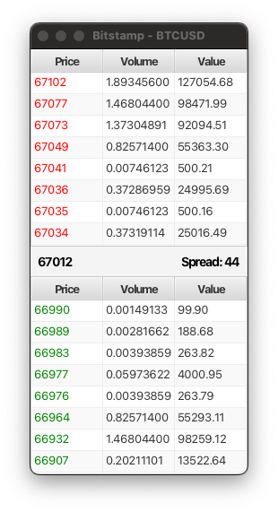

# lob

*Limit Order Book implemented in Java*

## Project structure

The source code are mainly in `app/src/main/java/lob` with several data structures being used written in `app/src/main/java/lob/ds`. The test code can be found at `app/src/test/java/lob` and there is one example which measures the performance of the LOB in `app/src/main/java/lob/example/App.java`.

## Running the tests 

This project uses gradle as its build tool so to run the tests you can do 

```sh
# On unix systems
./gradlew test

# On windows
./gradlew.bat test
```

## Running the examples

### Download

Download L3 Orderbook (Market-by-Order) data from the [Bitstamp](https://www.bitstamp.net/) exchange to `app/src/main/resources/l3_orderbook.ndjson`. Note that this download takes a long time since it stops only after 1 million messages has been received. The final file size is about *321MB* and took 7.5 hours. Hence, you should download this data from [here](https://drive.google.com/file/d/1RLvvqGpDGH6NJbi9YWKBHdr1ImOsZN7V/view?usp=sharing) instead.

```sh
# On unix systems
./gradlew run -Plaunch=lob.example.Download

# On windows
./gradlew.bat run -Plaunch=lob.example.Download
```

### Visualiser

This example comes with a simple GUI written with [JavaFX](https://openjfx.io/index.html) that visualise the limit order book similar to what traders see on their trading terminal. The live orders data comes from Bitstamp's publicly available L3 Orderbook data feed through WebSocket.

```sh
# On unix systems
./gradlew run -Plaunch=lob.example.Visualiser

# On windows
./gradlew.bat run -Plaunch=lob.example.Visualiser
```

Once the visualiser is opened, you should see a window as follows:



### Benchmark

This example reads 1 million messages which was previously downloaded and feed them into the limit order book and measure how long it takes.

```sh
# On unix systems
./gradlew run -Plaunch=lob.example.Benchmark

# On windows
./gradlew.bat run -Plaunch=lob.example.Benchmark
```
