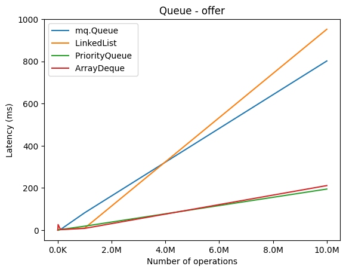
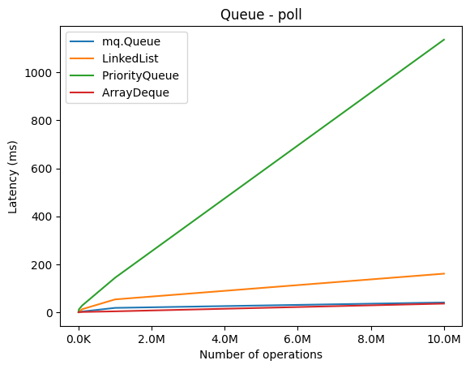

# mq

*Message Queue over TCP/IP written in Java*

*Authors: @marcustut, @rita1773, @sauransh*

## Table of Contents

1. [Abstract](#abstract)
2. [Background](#background)
3. [Design decisions](#design-decisions)
    - [Array-based queue](#array-based-queue)
    - [Circular queue](#circular-queue)
    - [Linked list based queue](#linked-list-based-queue)
    - [Our choice](#our-choice)
    - [Code design](#code-design)
4. [Use cases](#use-cases)
5. [Performance benchmark](#performance-benchmark)
    - [Latency analysis](#latency-analysis)
    - [Throughput analysis](#throughput-analysis)

## Abstract <a id="abstract"></a>

...

## Background <a id="background"></a>

Message passing between different interconnected machines has always been something that was deeply embedded in computing originating back to the 1960s when computers were still in its early days [[1]](#1). The very core part that powers these message passing interface is the message queue, a data structure that governs the communication between multiple parties usually identify as producers or consumers [[2]](#2). In recent years, due to the rise of service oriented architecture (SOA) and microservices [[3]](#3), the need of a reliable communication layer across hundreds if not thousands of services presents itself which gave birth to a lot of the open source message queues found today such as Apache Kafka, RabbitMQ, ZeroMQ, etc. Each of which has their own set of strengths and weaknesses however the underlying idea is simple enough that we decided to challenge ourselves to implement one in Java that relies on Tranmission Control Protocol (TCP/IP) for its networking layer.

## Design decisions <a id="design-decisions"></a>

There are plenty different implementations for queue such as array-based queue, circular queue, etc. each of which has their own pros and cons, a brief walkthrough of each implementation is discussed below and lastly we present the reason for our choice. 

For context, the criterias for our selection are:

- **First-In-First-Out (FIFO)** - The first message that goes into the queue should be prioritised to be processed first.
- **Equivalent time complexity for polling and inserting** - We want the operations for both polling and inserting to be similar so that a high amount of writes will not slow down the reads or vice versa.
- **Stable latency across many different operations** - As a communication medium between different services, ideally the time for message exchange should be predictable and rather constant otherwise it could introduce jitter.

### Array-based queue <a id="array-based-queue"></a>

Using an array to build the queue is arguably the simplest implementation since it is the most common data stucture. However, there are certain downsides to it as we dig further into the details of it.

<div align="center">
    
</div>

*<div align="center">Figure 1: Fixed-size array</div>*

#### Benefits 

Consider the figure above where we have a fixed size array of size 9 with the first 3 elements occupied, accessing the first element (polling) is fast since it is a constant time look up, inserting is also not an issue since it is also a constant time operation. In addition, having an array in memory is compact since all elements are stored in a contiguous block which helps with cache locality [[4]](#4) and can be further optimised to maximise cache hits in Translation Lookaside Buffer (TLB) by using huge pages in the operating system (OS) [[5]](#5).

#### Downsides

However there are several shortcomings to this approach one being that with every poll all subsequent elements has to be shifted down which is an `O(n)` operation, this does not scale well as the queue grows. Moreover, arrays are fixed size by default and when the array exceeds the current size it has to resize itself, this limitation still exist even if the implementation uses Java's `ArrayList` because the class itself also maintains a fixed size array behind the scenes and resizes whenever the number of element exceeds a certain capacity. In other words, insertion is constant time most of the time but it will be linear every once in a while when the array has to be resized and according to our selection criterias this is not acceptable since it would introduce an unpredictable spike in latency for the consumers.

### Circular queue <a id="cicular-queue"></a>

To overcome the shortcomings of the array-based queue, another common approach is to "wrap-around" the array resulting the queue to be circular, refer to the figure below for an illustration.

<div align="center">
    
</div>

*<div align="center">Figure 2: Circular queue with an array</div>*

#### Benefits

The idea of "wrap-around" is when the queue becomes full instead of resizing to accomodate the new message, the new message replaces the head of the queue and keep going. By doing so, it took away the need of allocating more memory and this approach keep all the benefits of using an array such as compact memory layout and cache-friendly. 

#### Downsides

That said, the significant downside to this solution is that when the buffer is full, old messages will get overwritten and this might be tolerable depending on the use cases but in our case it is not acceptable as we do not want a message to be lost before it has been processed. That said, if the condition where rate of message consumption is far higher than the rate of message production is guaranteed then circular queue is an excellent choice with its performance benefits.

### Linked list based queue <a id="linked-list-based-queue"></a>

<div align="center">
    
</div>

*<div align="center">Figure 3: Queue using singly linked list</div>*

#### Benefits

Linked list based queues are one of the most commonly used due to its ability to grow and shrink dynamically without needing to resize but at the same time preserving all elements in memory. On top of that, its implementation is also very simple usually does not involve too much code due to its strutural simplicity.

#### Downsides

Although it also supports all operations in `O(1)` time but it does not have the benefit of cache locality as compared to arrays because inherently the nodes does not necessarily live beside each other in a contiguous block, they are instead linked over using references or pointers since these nodes can be anywhere in memory. 

### Our choice <a id="our-choice"></a>

In the end we opted for a linked list based queue due to the following reasons:

1. Ability to grow and shrink in constant time, `O(1)`.
2. No resizing required.
3. Guarantees of no message lost since no elements will be overwritten.

On top of that, we made an optimisation to keep track of a `tail` node so that offering a new message would be also `O(1)` since the need to traverse the list has been lifted. So our implementation of a linked list queue resembles the following figure.

<div align="center">
    
</div>

*<div align="center">Figure 4: Queue using singly linked list with tail</div>*

### Code design <a id="code-design"></a>

The class can be found at `src/mq/Queue.java` and its corresponding test is at `src/tests/QueueTest.java`. We implemented the `Queue` class to be generic although for the message queue the only type being using is `String` but there is no reason to not implement it as a generics since this code can be used in the future for other use cases. On top of that, instead of writing our own methods, we decided to implement `java.util.AbstractQueue` so it plays well with other part of the Java ecosystem code and also it gives us the ability to change the underlying implementation without updating the driver code since the queue is used through an interface. 

The following snippet shows the class members and the operations it supports through the `AbstractQueue` interface redacting the implementation.

```java
public class Queue<T> extends AbstractQueue<T> {
    private class Node {
        private T data;
        private Node next;

        Node(T data) {
            this.data = data;
        }
    }

    private Node head, tail;
    private int size = 0;

    @Override
    public boolean offer(T e) {}

    @Override
    public T poll() {}

    @Override
    public T peek() {}

    @Override
    public Iterator<T> iterator() {}

    @Override
    public int size() {}

    @Override
    public int isEmpty() {}
}
```

One interesting mention here is that the `Queue` supports `java.util.Iterator` and this opens up the door for users to use it with the new Java Stream API since converting an iterator to a stream is simple. Then, the users will be able to use the queue just as any stream such as using the `.forEach()`, `.map()` and `.filter()`.

For example, the following snippet is taken from the test code and it shows the usage of Java Stream with the class.

```java
    // Create the queue
    Queue<String> queue = new Queue<>();
    queue.add("Alice");
    queue.add("Bob");
    queue.add("Candy");

    // Turn the iterator into a stream
    Stream<String> stream = StreamSupport.stream(
        Spliterators.spliteratorUnknownSize(queue.iterator(), Spliterator.ORDERED),
        false);

    // Map over the stream to make a list of wordcount
    List<Integer> list = stream.map(x -> x.length()).collect(Collectors.toList());
```

## Use cases <a id="use-cases"></a>

...

## Performance benchmark <a id="performance-benchmark"></a>

To measure how well our implementation of queue performs, we designed a benchmark to compare the latency and throughput of `mq.Queue` against queue implementations from the Java standard library, namely `LinkedList`, `PriorityQueue` and `ArrayDeque`. The benchmark code can be found in `src/benchmark/Main.java` and these plots are generated by running `plot.py` which uses `matplotlib` to visualise the outputs from the benchmark program.

### Latency analysis <a id="latency-analysis"></a>

<div align="center" style="display: flex;">
    
    
</div>

*<div align="center">Figure 5: Latency for offer and poll across different queues</div>*

From figure 5 above we can see two charts, one for the **offer** operation which enqueue an element at the tail and the other for the **poll** operation which dequeue an element from the head. We can see that for the **offer** operation, both `ArrayDeque` and `PriorityQueue` performed significantly faster than `LinkedList` and `mq.Queue` which are both based on linked list under the hood. Our speculation is that as number of operation increases, the effect of cache locality starts to show its significance since both `ArrayDeque` and `PriorityQueue` uses array under the hood to store the elements. In addition, one interesting observation is that the latency for `ArrayDeque` spiked at around 0 - 10k operations, this is expected since the underlying array has to resize when the insertion exceeds the current capacity.

As for the **poll** operation, `PriorityQueue` performed the worst and from the graph we can clearly see that `mq.Queue`, `ArrayDeque` and `LinkedList` scaled well as the number of operations increases which is close to constant time *O(1)*. This is due to the fact that `PriorityQueue` uses a binary heap under the hood which implies ordering hence to poll (remove) an element it has to find the element in heap which results in a *O(log n)* time complexity.

### Throughput analysis <a id="throughput-analysis"></a>

<div align="center" style="display: grid; gap: 1em; grid-template-rows: repeat(2, minmax(0, 1fr)); 	grid-template-columns: repeat(3, minmax(0, 1fr));">
    
    
    
    
    
    
</div>

*<div align="center">Figure 6: Throughput comparison for offer across different queues</div>*

Figure 6 above shows the throughput for the `offer` operation across different number of operations which measure the operations that the queue can process per second. Here we can observe that `ArrayDeque` has the highest throughput in most scenarios except at 10k operations where it performed marginally slower than the others, this is due to the resizing issue as can also be seen in Figure 5 above. As for `mq.Queue`, it performed generally well between 1k - 100k operations beating `LinkedList` and `PriorityQueue` and is on par with `ArrayDeque` at 1k operations.

<div align="center" style="display: grid; gap: 1em; grid-template-rows: repeat(2, minmax(0, 1fr)); 	grid-template-columns: repeat(3, minmax(0, 1fr));">
    
    
    
    
    
    
</div>

*<div align="center">Figure 7: Throughput comparison for poll across different queues</div>*

Figure 7 above shows the throughput for the poll operation and as can be seen, both `mq.Queue` and `ArrayDeque` outperformed the others significantly with `mq.Queue` having higher throughput at 100 and 1000 operations and `ArrayDeque` performed the best in other number of operations.

### Conclusion

From the analysis that we have performed we can deduce that generally `ArrayDeque` has the highest performance except for the fact that it has resizing issue which can introduce latency spikes (jitter). Although this can be solved by reserving a large chunk of memory but it incurs an overhead in memory cost when these reserved space are not being used. Considering that we do not expect a high traffic for our message queue, `mq.Queue` is still the best choice for an expected traffic of 0 - 100k operations while only uses memory that it needs.

## References

<a id="1">[1]</a> *Leiner, B. M., Cerf, V. G., Clark, D. D., Kahn, R. E., Kleinrock, L., Lynch, D. C., ... & Wolff, S. S.* (1997). **The past and future history of the Internet**. Communications of the ACM, 40(2), 102-108. [PDF 🔗](https://dl.acm.org/doi/pdf/10.1145/253671.253741)

<a id="2">[2]</a> *Jeffay, K.* (1993, March). **The real-time producer/consumer paradigm: A paradigm for the construction of efficient, predictable real-time systems.** In Proceedings of the 1993 ACM/SIGAPP symposium on Applied computing: states of the art and practice (pp. 796-804). [PDF 🔗](https://dl.acm.org/doi/pdf/10.1145/162754.168703)

<a id="3">[3]</a> *Thönes, J*. (2015). **Microservices**. In IEEE Software (Vol. 32, Issue 1, pp. 116–116). Institute of Electrical and Electronics Engineers (IEEE). [](https://doi.org/10.1109/ms.2015.11)

<a id="4">[4]</a> *Grunwald, D., Zorn, B., & Henderson, R.* (1993). **Improving the cache locality of memory allocation**. In Proceedings of the ACM SIGPLAN 1993 conference on Programming language design and implementation. PLDI93: ACM SIGPLAN Conference on Programming Languages Design and Implementation. ACM. [](https://doi.org/10.1145/155090.155107)

<a id="5">[5]</a> *Panwar, A., Prasad, A., & Gopinath, K.* (2018). **Making Huge Pages Actually Useful**. In Proceedings of the Twenty-Third International Conference on Architectural Support for Programming Languages and Operating Systems. ASPLOS ’18: Architectural Support for Programming Languages and Operating Systems. ACM. [](https://doi.org/10.1145/3173162.3173203)